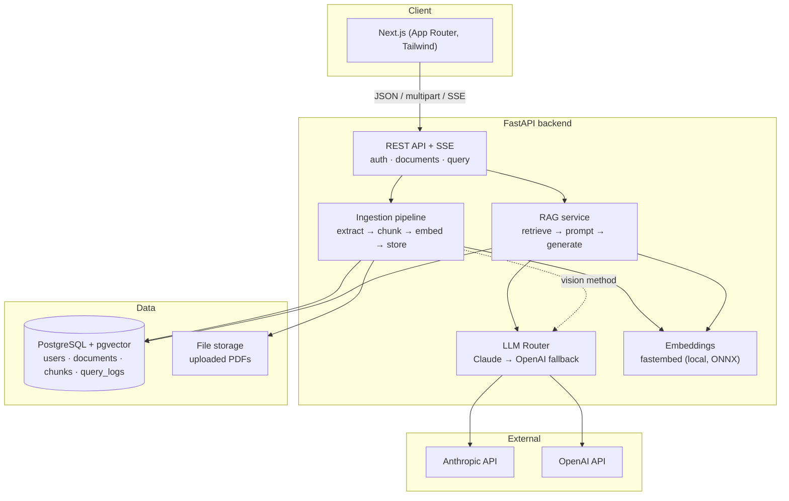
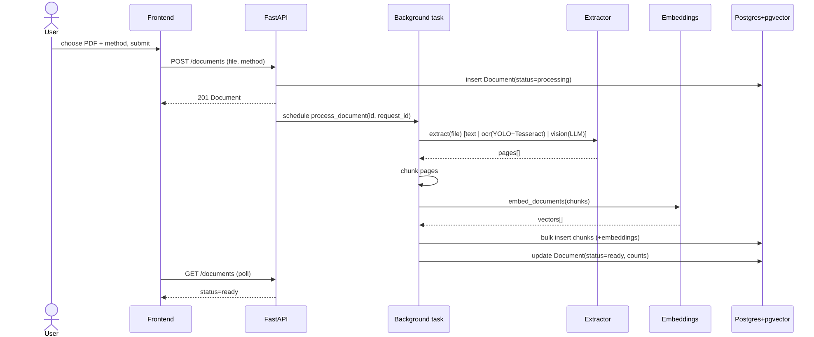
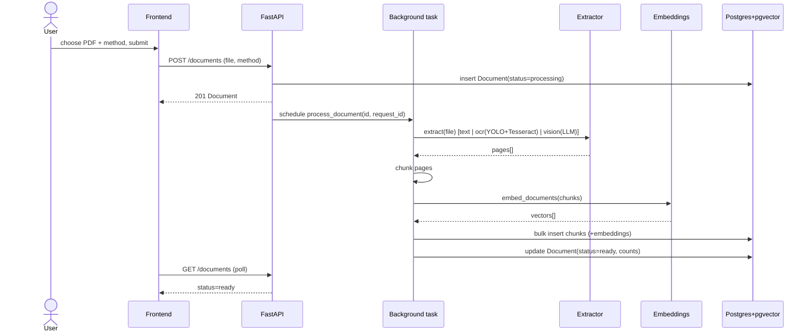
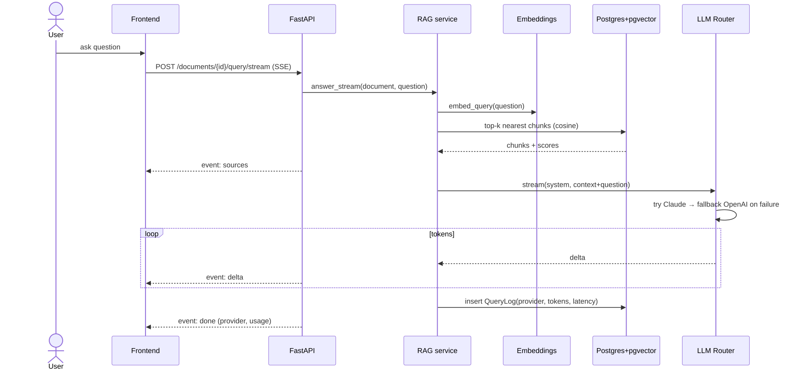
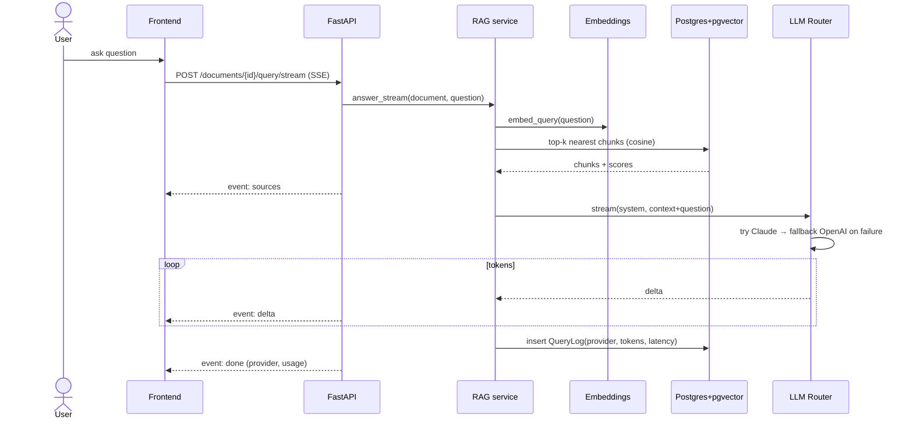
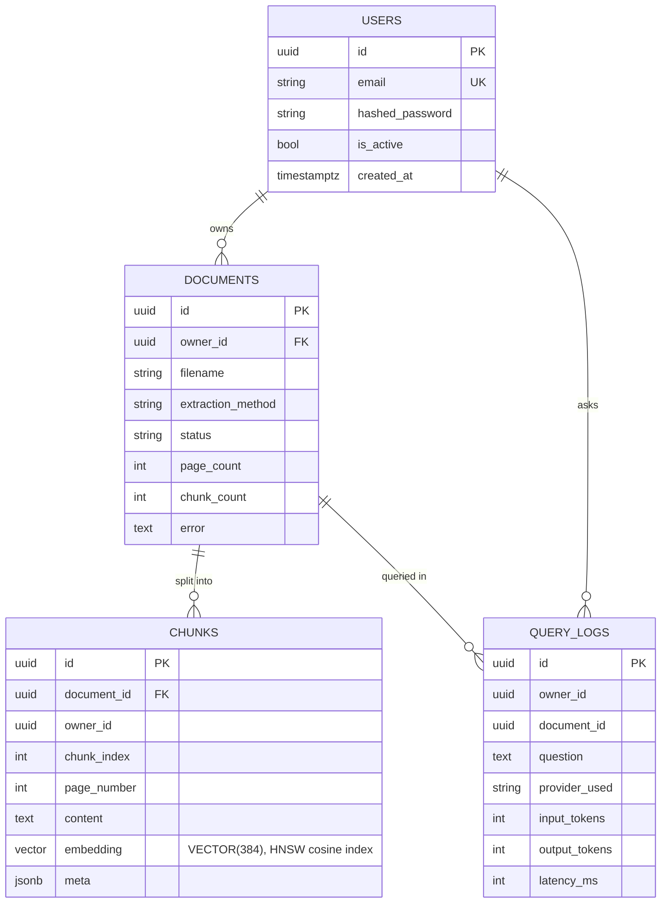
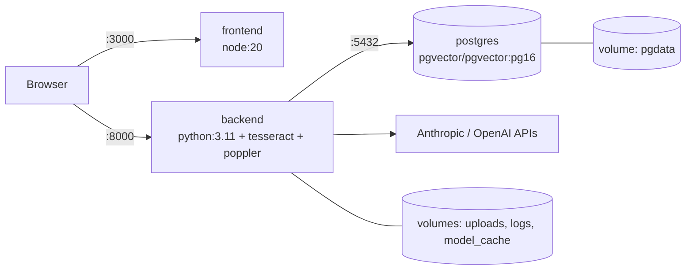

# Architecture

This document describes the system design of the Document Analysis Platform: its components,
data flow, data model, and the key decisions behind them.

## Overview

The platform is a two-tier application — a **Next.js** frontend and a **FastAPI** backend —
backed by a single **PostgreSQL + pgvector** datastore. Document content and its vector
embeddings live together in Postgres; the LLM layer is provider-agnostic with Claude as the
primary and OpenAI as an automatic fallback.



<details>
<summary>Mermaid source</summary>



</details>

## Components

### Frontend (`frontend/`)
- **App Router pages**: `login`, `register`, `documents` (upload + list), `chat/[docId]`.
- **`AuthContext`** holds the user/session; the access token is stored in `localStorage` and
  attached by the API client, which transparently refreshes on `401`.
- **`UploadForm` + `ExtractionMethodPicker`** let the user choose Text / OCR / Vision per upload.
- **`ChatPanel`** consumes the answer **SSE stream** (via `fetch`, so it can send the auth
  header), rendering tokens as they arrive plus a Sources panel and the answering provider.

### Backend (`backend/app/`)
- **`api/routes/`** — `auth`, `documents`, `query` (+ `health`). Thin controllers; logic lives
  in services.
- **`services/extraction/`** — `TextExtractor` (PyMuPDF), `OCRExtractor` (poppler → YOLO layout
  → Tesseract), `VisionExtractor` (page image → LLM), selected by `factory.get_extractor`.
- **`services/chunking.py`** — per-page recursive character chunker with overlap.
- **`services/embeddings.py`** — local `fastembed` model (`bge-small-en-v1.5`, 384-dim).
- **`services/vectorstore.py`** — pgvector insert + cosine-distance top-k search.
- **`services/llm/`** — `LLMProvider` interface, `AnthropicProvider`, `OpenAIProvider`, and the
  `LLMRouter` that does primary→fallback for both `complete()` and `stream()`.
- **`services/rag.py`** — orchestrates retrieval + generation, persists a `QueryLog`.
- **`services/pipeline.py`** — end-to-end ingestion, run as a background task.
- **`core/`** — settings, logging, request-id context, JWT/password security, dependencies.

## Ingestion flow



<details>
<summary>Mermaid source</summary>



</details>

## Query (RAG) flow



<details>
<summary>Mermaid source</summary>



</details>

## Data model



<details>
<summary>Mermaid source</summary>



</details>

Retrieval is a single indexed query:

```sql
SELECT * FROM chunks
WHERE owner_id = :owner AND document_id = :doc
ORDER BY embedding <=> :query_embedding   -- cosine distance, HNSW index
LIMIT :k;
```

## Deployment (containers)



<details>
<summary>Mermaid source</summary>



</details>

## Key design decisions

- **Postgres + pgvector instead of a separate vector DB.** Chunks (the relational source of
  truth) and their embeddings live in one store, so there's no second system to keep in sync.
  An HNSW index gives fast approximate cosine search.
- **Local embeddings (fastembed/ONNX).** Anthropic has no embeddings endpoint, so RAG would
  otherwise need a third provider. fastembed runs on CPU, needs no API key, and avoids a torch
  dependency. The `embeddings.py` interface makes swapping in a hosted embedder (e.g. Voyage)
  straightforward — the embedding dimension is the only migration-sensitive part.
- **Provider-agnostic LLM with automatic fallback.** One `LLMProvider` interface plus a router
  means Claude is primary and OpenAI takes over on error/rate-limit. Streaming only falls back
  *before* the first token, so a client never sees a torn answer.
- **Three explicit extraction methods.** Different documents need different handling; exposing
  the choice (Text/OCR/Vision) in the UI keeps the trade-off (speed vs. robustness vs. cost)
  with the user. OCR reuses the original project's YOLO layout-analysis idea.
- **Ingestion off the request path.** Extraction/embedding can be slow, so uploads return
  immediately and processing runs as a background task that records success/failure on the row.
- **Correlation-id logging end to end.** Every request gets an id that is attached to all logs
  (including the background ingestion task) and returned as `X-Request-ID` — see
  [docs/LOGGING.md](docs/LOGGING.md).
